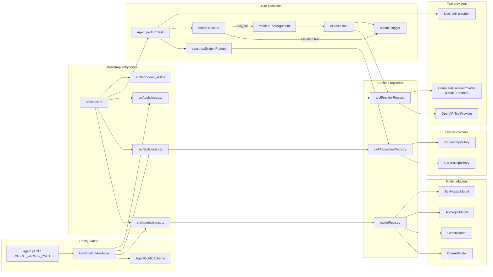

# agentic_harness

`agentic_harness` is a TypeScript-based agent runtime that loads model definitions from YAML config, registers those models into a shared registry, and runs a CLI loop that sends user prompts to the default model. It is currently a command-line harness, but the structure is intentionally small enough to evolve into an HTTP service later.

## What it does today

- Loads model configuration from YAML via `src/config/config.ts`.
- Registers models by brand into the shared model registry.
- Registers skill repositories from config and loads their `SKILL.md` files into the agent system prompt.
- Registers config-driven OpenAPI tool providers, while the built-in `load_skill` tool is attached directly by the `Agent` constructor.
- Runs a simple interactive CLI from `src/index.ts`.
- Supports tool calling through the agent loop.
- Supports both zip-backed and git-backed skill repositories via `agent.yaml`.

## Runtime flow

1. `src/index.ts` imports `src/models`, `src/skills`, and `src/tools`, which each load config and register their respective runtime plugins.
2. The CLI creates an `Agent` with the registered skill repositories and config-driven tool providers.
3. The program enters a REPL loop and reads user input from stdin.
4. The message is appended to the conversation history.
5. The agent builds a system prompt from the loaded skills and sends the conversation to the default registered model.
6. If the model returns tool calls, the harness validates the arguments, executes the matching tools, and feeds the results back into the model until the turn finishes.
7. The resulting assistant messages, tool calls, and tool responses are printed to stdout.

## Architecture diagram

The harness is split into a small bootstrap layer, three registry-backed plugin surfaces, and one agent loop that orchestrates the full turn.



### How the mapping works

- Model config entries are filtered by `brand` and registered into `modelRegistry` by `src/models/openai.ts`, `src/models/gemini.ts`, `src/models/anthropic.ts`, and `src/models/self_hosted.ts`.
- Skill repository config entries are registered into `skillRepositoryRegistry` by `src/skills/git_skill_repo.ts` and `src/skills/zip_skill_repo.ts`.
- Tool provider config entries are registered into `toolProviderRegistry` by `src/tools/index.ts`; `src/tools/openapi` handles OpenAPI specs and `src/tools/computer_use` handles local/remote OS computer tools.
- The built-in `load_skill` provider lives in `src/tools/load_skill.ts` and is attached by the `Agent` constructor, not by config.
- `Agent.performTask()` pulls the default model, gathers all tools from all providers, validates tool call arguments, executes tools, and loops until the model stops asking for tool execution.

## Testing map

The test suite mirrors the same seams as the runtime wiring:

- `src/agents/agents.test.ts` covers the agent loop, tool-call execution, and multi-step history updates.
- `src/models/*.test.ts` covers brand-specific model registration and adapter behavior.
- `src/models/self_host.integration.test.ts` exercises a live self-hosted completion request when `SELF_HOSTED_MODEL_BASE_URL` is set.
- `src/skills/git_skill_repo.test.ts` and `src/skills/zip_skill_repo.test.ts` cover skill discovery, subdirectory filtering, and parsing.
- `src/skills/git_skill_repo.integration.test.ts` and `src/skills/zip_skill_repo.integration.test.ts` cover real git and HTTP-zip loading paths.
- `src/tools/tool_argument.test.ts` covers JSON-schema-style argument validation for tool inputs.
- `src/tools/computer_use/*.test.ts` covers computer interface tool builders, local host OS execution (`LocalComputer`), ConnectRPC remote execution (`RemoteComputer`), and provider registration.
- The built-in `load_skill` provider is exercised indirectly by the agent tests through `Agent.performTask()`.

In practice, the unit tests validate the control flow and mapping logic, while the integration tests verify that the external adapters still work against a real git repo, a real zip payload, or a live model endpoint.

## Inputs

### 1. User input

The current executable is interactive and reads plain text from stdin.

Example:

```text
Enter a message for the agent (or 'exit' to quit):
```

Type a message and press Enter. Type `exit` to terminate the process.

### 2. Agent config

The runtime looks for an `agent.yaml` file and uses it to register models.

Config resolution order:

1. `AGENT_CONFIG_PATH` if it points to an existing file
2. `./agent.yaml` in the current working directory
3. `/etc/agent/agent.yaml`

Model config schema:

```yaml
models:
  - name: gpt4
    brand: openai
    properties:
      apiKey: "sk-..."

  - name: gemini-fast
    brand: gemini
    properties:
      apiKey: "..."

  - name: claude
    brand: anthropic
    properties:
      apiKey: "..."
      maxTokens: 4096

  - name: local-llm
    brand: self_hosted
    properties:
      baseUrl: "http://localhost:8000/v1"
      apiKey: "local-api-key"
```

Brand-specific properties:

- `openai`
  - `apiKey` defaults to `OPENAI_API_KEY` if omitted.
- `gemini`
  - `apiKey` defaults to `GEMINI_API_KEY` if omitted.
- `anthropic`
  - `apiKey` defaults to `ANTHROPIC_API_KEY` if omitted.
  - `maxTokens` defaults to `4096`.
- `self_hosted`
  - `baseUrl` is required and must be a valid URL.
  - `apiKey` is optional.

Skill repository config:

```yaml
skillRepositories:
  - type: zip
    location: "/path/to/skills.zip"
    skillsSubdirectory: "/"

  - type: git
    url: "git@github.com:org/skills.git"
    branch: "main"
    skillsSubdirectory: "nested"
    auth:
      method: ssh
      privateKeyPath: "~/.ssh/id_ed25519"
```

- `zip`
  - `location` points to a local zip file or HTTP zip URL.
  - `skillsSubdirectory` defaults to `/` and limits loading to a nested subtree inside the archive.
- `git`
  - `url` points to a git repository path or remote URL.
  - `branch` defaults to `main`.
  - `skillsSubdirectory` defaults to `/` and limits loading to a nested subtree in the checkout.
  - `auth.method: ssh` uses `GIT_SSH_COMMAND` with the configured private key path.
  - `auth.method: token` injects token auth into HTTPS clone URLs.
  - `auth.method: none` uses the URL as-is.

Tool provider config (`toolProviders` in `agent.yaml`):

```yaml
toolProviders:
  # 1. OpenAPI Tool Provider
  - name: "petstore-api"
    type: openapi
    specUrl: "http://localhost:8080/openapi.json"
    securityVariables:
      type: apiKey            # Options: apiKey, bearerToken, basicAuth, custom, oauth2
      key: "secret-api-key"
      name: "X-API-Key"        # Header/query/cookie parameter name (default: X-API-Key)
      location: "header"      # Header, query, or cookie (default: header)

  # 2. Computer Use Tool Provider (Local execution)
  - type: computer
    provider:
      type: local
      enableGUIToolsIfAvailable: true  # Enables GUI automation if DISPLAY environment variable is present

  # 3. Computer Use Tool Provider (Remote sandbox execution via ConnectRPC)
  - type: computer
    provider:
      type: remote
      url: "http://localhost:8080"      # ConnectRPC base URL of computer controller
      image: "ubuntu:latest"           # Sandbox container image
      enableGUIToolsIfAvailable: true  # Enables GUI automation if container image supports display
      envFile: ".env"                  # Path to environment file
      security:
        apiKey: "remote-secret"
        mtls:
          clientCert: "/path/to/cert.pem"  # Client cert file path or full-chain PEM
          clientKey: "/path/to/key.pem"    # Optional client private key file path or PEM
          caCert: "/path/to/ca.pem"        # Optional CA cert file (defaults to clientCert if omitted for full-chain certs)
      networkRules:
        allowedHosts: "*"             # Wildcard string or array of allowed outbound hosts
        deniedHosts: []
      resources:
        cpu: "2"                      # Number of CPU cores (e.g. 2, 0.5) or millicores (500m)
        memory: "4GiB"                # Memory size format (e.g. '512MB', '4GiB')
      environment:
        - "VAR_NAME=value"            # Array of "KEY=VALUE" strings or key-value dictionary
```

### Tool Provider Configuration Options

#### OpenAPI Tool Provider (`type: openapi`)

| Parameter | Type | Required | Description | Status |
|---|---|---|---|---|
| `name` | String | Yes | Identifier prefix for generated tools | **Implemented** |
| `specUrl` | String | Yes | URL or file path to OpenAPI / Swagger document | **Implemented** |
| `securityVariables.type` | String | Yes | Auth type (`apiKey`, `bearerToken`, `basicAuth`, `custom`, `oauth2`) | `apiKey`, `bearerToken`, `basicAuth`, `custom` **Implemented**; `oauth2` **Unimplemented** |
| `securityVariables.key` | String | Optional | API Key secret string (for `apiKey`) | **Implemented** |
| `securityVariables.token` | String | Optional | Bearer token string (for `bearerToken`) | **Implemented** |
| `securityVariables.username` / `password` | String | Optional | Credentials (for `basicAuth`) | **Implemented** |
| `securityVariables.headers` / `queryParams` | Object | Optional | Custom header & query param mappings (for `custom`) | **Implemented** |

#### Computer Use Tool Provider (`type: computer`)

| Provider Backend | Parameter | Type | Required | Description | Status |
|---|---|---|---|---|---|
| `local` | `provider.type` | `"local"` | Yes | Local host execution backend | **Implemented** |
| `local` | `enableGUIToolsIfAvailable` | Boolean | Yes | Enables GUI tools if `DISPLAY` / `WAYLAND_DISPLAY` is present | **Implemented** (Linux/X11); Windows/macOS **Unimplemented** |
| `remote` | `provider.type` | `"remote"` | Yes | Remote container sandbox ConnectRPC backend | **Implemented** |
| `remote` | `url` | String | Yes | ConnectRPC server base URL | **Implemented** |
| `remote` | `image` | String | Yes | Docker image name | **Implemented** |
| `remote` | `enableGUIToolsIfAvailable` | Boolean | Optional | Enables GUI tools for graphical computer containers | **Implemented** |
| `remote` | `envFile` | String | Yes | Path to `.env` file | **Implemented** |
| `remote` | `security` | Object | Optional | Auth options (`apiKey`, `mtls.clientCert`, `mtls.clientKey`, `mtls.caCert`) | **Implemented** |
| `remote` | `networkRules` | Object | Optional | Egress rules (`allowedHosts`, `deniedHosts`) | **Implemented** |
| `remote` | `resources` | Object | Optional | Container limits (`cpu`, `memory`) | **Implemented** |
| `remote` | `environment` | Array/Object | Optional | Environment variables array or key-value dictionary | **Implemented** |
| `remote` | `computerLifetime` | Enum | Optional | Multi-tenant RBAC session lifetime (`server`, `user`, `session`) | **Unimplemented** (Deferred to event-driven refactor) |

#### Implemented vs Unimplemented Features Summary

| Tool Provider | Feature / Capability | Status | Details |
|---|---|---|---|
| **OpenAPI** | Spec dereferencing & normalization | **Implemented** | Supports OpenAPI 3.0/3.1 and Swagger 2.0 via `@apidevtools/swagger-parser` |
| **OpenAPI** | Dynamic JSON Schema builder | **Implemented** | Builds tool schemas from path, query, and request body specs |
| **OpenAPI** | HTTP Request execution | **Implemented** | Supports GET, POST, PUT, DELETE, PATCH, HEAD, OPTIONS, TRACE |
| **OpenAPI** | Auth (ApiKey, Bearer, Basic, Custom) | **Implemented** | Header, query, and cookie authentication injection |
| **OpenAPI** | Interactive OAuth2 Flow | **Unimplemented** | OAuth2 schema is validated, but token retrieval flow is deferred |
| **Computer Use** | Core Abstractions & Tool Builder | **Implemented** | `HeadlessComputer` & `GraphicalComputer` interfaces + `buildComputerTools` (6 basic, 13 GUI tools) |
| **Computer Use** | Remote Provider (`remote`) | **Implemented** | ConnectRPC client (`BasicComputerService`, `GraphicalComputerService`, `ComputerProviderService`) |
| **Computer Use** | Local Provider (`local`) | **Implemented** | Node `child_process`/`fs` + Linux utilities (`xdotool`, `xclip`, `maim`/`scrot`/`import`) |
| **Computer Use** | Session RBAC & Lifetime | **Unimplemented** | `computerLifetime` (server, user, session) deferred to event-driven refactor |
| **Computer Use** | Windows / macOS Local GUI | **Unimplemented** | `LocalGraphicalComputer` currently relies on Linux/X11 utilities |


## Outputs

The program writes to stdout and logs through the shared logger.

Typical output includes:

- agent startup information
- `<<Processing>>...` while a turn is running
- assistant text responses
- tool call summaries
- tool execution results
- warnings when a configured model is skipped

The process exits cleanly when you type `exit`.

## Prerequisites

- Node.js 20 or newer is recommended.
- `pnpm` is used for dependency management and scripts.
- A valid `agent.yaml` file, or `AGENT_CONFIG_PATH`, if you want any models to be registered.

## Install and run

From `agentic_harness/`:

```bash
pnpm install
pnpm start
```

The `start` script builds the project and runs the compiled CLI.

Useful development commands:

```bash
pnpm test
pnpm typecheck
pnpm build
```

## Current limitations

- The runtime is CLI-based today; there is no HTTP API yet.
- The example agent in `src/index.ts` is intentionally minimal and only demonstrates a single weather tool provider.
- Model registration depends on the config file being present at startup.

## Future HTTP service shape

When this is turned into a service, the same pieces should still apply:

- config remains the source of truth for model registration
- requests will likely become HTTP payloads instead of stdin prompts
- responses will likely be JSON instead of terminal output
- tool execution will remain part of the agent loop

Keeping this document here should make it easier to preserve the runtime contract as the harness evolves.
