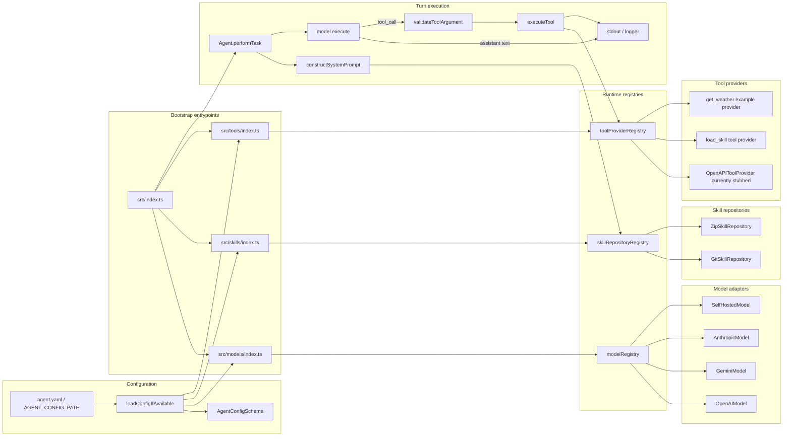

# agentic_harness

`agentic_harness` is a TypeScript-based agent runtime that loads model definitions from YAML config, registers those models into a shared registry, and runs a CLI loop that sends user prompts to the default model. It is currently a command-line harness, but the structure is intentionally small enough to evolve into an HTTP service later.

## What it does today

- Loads model configuration from YAML via `src/config/config.ts`.
- Registers models by brand into the shared model registry.
- Runs a simple interactive CLI from `src/index.ts`.
- Supports tool calling through the agent loop.
- Includes an example weather tool in the CLI entrypoint so you can see the request/response flow end to end.
- Supports skills loading through the agent framework, although the current CLI example does not mount any skill repositories.
- Supports both zip-backed and git-backed skill repositories via `agent.yaml`.

## Runtime flow

1. `src/index.ts` imports `src/models`, which loads config and registers available models.
2. The CLI creates an `Agent` and a sample `get_weather` tool provider.
3. The program enters a REPL loop and reads user input from stdin.
4. The message is appended to the conversation history.
5. The agent sends the conversation to the default registered model.
6. If the model returns tool calls, the harness executes the matching tools and feeds the results back into the model until the turn finishes.
7. The resulting assistant messages, tool calls, and tool responses are printed to stdout.

## Architecture diagram

The harness is split into a small bootstrap layer, three registry-backed plugin surfaces, and one agent loop that orchestrates the full turn.



### How the mapping works

- Model config entries are filtered by `brand` and registered into `modelRegistry` by `src/models/openai.ts`, `src/models/gemini.ts`, `src/models/anthropic.ts`, and `src/models/self_hosted.ts`.
- Skill repository config entries are registered into `skillRepositoryRegistry` by `src/skills/git_skill_repo.ts` and `src/skills/zip_skill_repo.ts`.
- Tool provider config entries are registered into `toolProviderRegistry` by `src/tools/index.ts`; `src/tools/openapi.ts` is wired in, but the provider methods are still stubs.
- `Agent.performTask()` pulls the default model, gathers all tools from all providers, validates tool call arguments, executes tools, and loops until the model stops asking for tool execution.

## Testing map

The test suite mirrors the same seams as the runtime wiring:

- `src/agents/agents.test.ts` covers the agent loop, tool-call execution, and multi-step history updates.
- `src/models/*.test.ts` covers brand-specific model registration and adapter behavior.
- `src/models/self_host.integration.test.ts` exercises a live self-hosted completion request when `SELF_HOSTED_MODEL_BASE_URL` is set.
- `src/skills/git_skill_repo.test.ts` and `src/skills/zip_skill_repo.test.ts` cover skill discovery, subdirectory filtering, and parsing.
- `src/skills/git_skill_repo.integration.test.ts` and `src/skills/zip_skill_repo.integration.test.ts` cover real git and HTTP-zip loading paths.
- `src/tools/tool_argument.test.ts` covers JSON-schema-style argument validation for tool inputs.

In practice, the unit tests validate the control flow and mapping logic, while the integration tests verify that the external adapters still work against a real git repo, a real zip payload, or a live model endpoint.

## Inputs

### 1. User input

The current executable is interactive and reads plain text from stdin.

Example:

```text
Enter a message for the agent (or 'exit' to quit):
```

Type a message and press Enter. Type `exit` to terminate the process.

### 2. Agent config

The runtime looks for an `agent.yaml` file and uses it to register models.

Config resolution order:

1. `AGENT_CONFIG_PATH` if it points to an existing file
2. `./agent.yaml` in the current working directory
3. `/etc/agent/agent.yaml`

Model config schema:

```yaml
models:
  - name: gpt4
    brand: openai
    properties:
      apiKey: "sk-..."

  - name: gemini-fast
    brand: gemini
    properties:
      apiKey: "..."

  - name: claude
    brand: anthropic
    properties:
      apiKey: "..."
      maxTokens: 4096

  - name: local-llm
    brand: self_hosted
    properties:
      baseUrl: "http://localhost:8000/v1"
      apiKey: "local-api-key"
```

Brand-specific properties:

- `openai`
  - `apiKey` defaults to `OPENAI_API_KEY` if omitted.
- `gemini`
  - `apiKey` defaults to `GEMINI_API_KEY` if omitted.
- `anthropic`
  - `apiKey` defaults to `ANTHROPIC_API_KEY` if omitted.
  - `maxTokens` defaults to `4096`.
- `self_hosted`
  - `baseUrl` is required and must be a valid URL.
  - `apiKey` is optional.

Skill repository config:

```yaml
skillRepositories:
  - type: zip
    location: "/path/to/skills.zip"
    skillsSubdirectory: "/"

  - type: git
    url: "git@github.com:org/skills.git"
    branch: "main"
    skillsSubdirectory: "nested"
    auth:
      method: ssh
      privateKeyPath: "~/.ssh/id_ed25519"
```

- `zip`
  - `location` points to a local zip file or HTTP zip URL.
  - `skillsSubdirectory` defaults to `/` and limits loading to a nested subtree inside the archive.
- `git`
  - `url` points to a git repository path or remote URL.
  - `branch` defaults to `main`.
  - `skillsSubdirectory` defaults to `/` and limits loading to a nested subtree in the checkout.
  - `auth.method: ssh` uses `GIT_SSH_COMMAND` with the configured private key path.
  - `auth.method: token` injects token auth into HTTPS clone URLs.
  - `auth.method: none` uses the URL as-is.

## Outputs

The program writes to stdout and logs through the shared logger.

Typical output includes:

- agent startup information
- `<<Processing>>...` while a turn is running
- assistant text responses
- tool call summaries
- tool execution results
- warnings when a configured model is skipped

The process exits cleanly when you type `exit`.

## Prerequisites

- Node.js 20 or newer is recommended.
- `pnpm` is used for dependency management and scripts.
- A valid `agent.yaml` file, or `AGENT_CONFIG_PATH`, if you want any models to be registered.

## Install and run

From `agentic_harness/`:

```bash
pnpm install
pnpm start
```

The `start` script builds the project and runs the compiled CLI.

Useful development commands:

```bash
pnpm test
pnpm typecheck
pnpm build
```

## Current limitations

- The runtime is CLI-based today; there is no HTTP API yet.
- The example agent in `src/index.ts` is intentionally minimal and only demonstrates a single weather tool provider.
- Model registration depends on the config file being present at startup.

## Future HTTP service shape

When this is turned into a service, the same pieces should still apply:

- config remains the source of truth for model registration
- requests will likely become HTTP payloads instead of stdin prompts
- responses will likely be JSON instead of terminal output
- tool execution will remain part of the agent loop

Keeping this document here should make it easier to preserve the runtime contract as the harness evolves.
