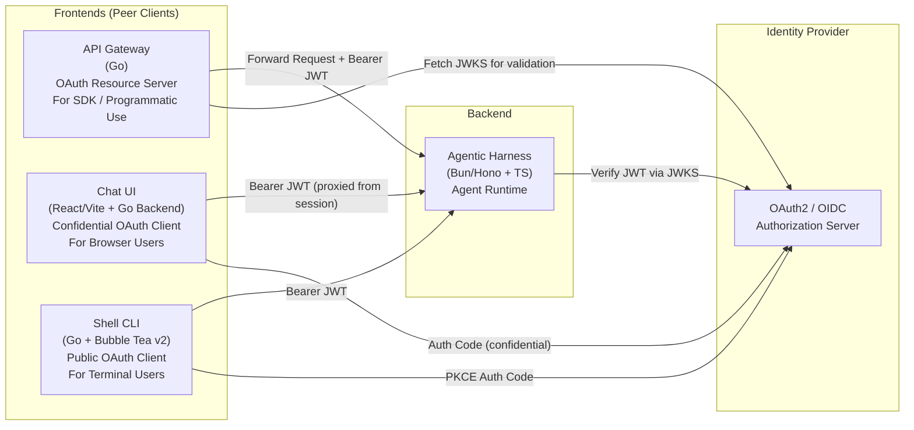

# Frontend Applications Architecture

The **BYoAI Deployment Platform** features three peer frontend applications residing in `apps/`. Each frontend serves a distinct interaction mode and communicates **directly** with the downstream [Agentic Harness](harness.md).

---

## 1. API Gateway (`apps/api-gateway`)
- **Role**: OAuth2 Resource Server & programmatic reverse proxy for external SDKs and system integrations.
- **Security**: Validates JWT signatures against an OIDC `JWKS_URI` using `keyfunc/v3` and `golang-jwt/v5`.
- **Proxy**: Utilizes standard Go `ReverseProxy` with immediate unbuffered flushing (`FlushInterval: -1`) to stream SSE events without buffering.

## 2. Chat UI (`apps/chat-ui`)
- **Role**: Rich web chat interface for browser users.
- **Frontend**: Vite + React 19 + TypeScript + Tailwind CSS v4 + `@assistant-ui/react`.
- **Go Backend**: Confidential OAuth client that handles authorization code flow, manages encrypted session cookies (`gorilla/sessions`), injects Bearer tokens server-side, and serves the static SPA via `embed.FS`.
- **Input Locking**: Prevents race conditions and user collision by disabling text input while an agent is executing until `agent:complete` SSE event is received.

## 3. Shell CLI (`apps/shell-cli`)
- **Role**: Terminal user interface (TUI) and batch CLI for developers.
- **TUI Engine**: Built with Charm's `bubbletea/v2`, `lipgloss/v2`, and `bubbles/v2`.
- **OAuth PKCE**: Public OAuth client initiating browser authorization flow with an ephemeral localhost callback receiver and storing tokens at `~/.byoai/tokens.json`.
- **Modes**: Supports both interactive turn-based chat and non-interactive one-shot batch tasks.
