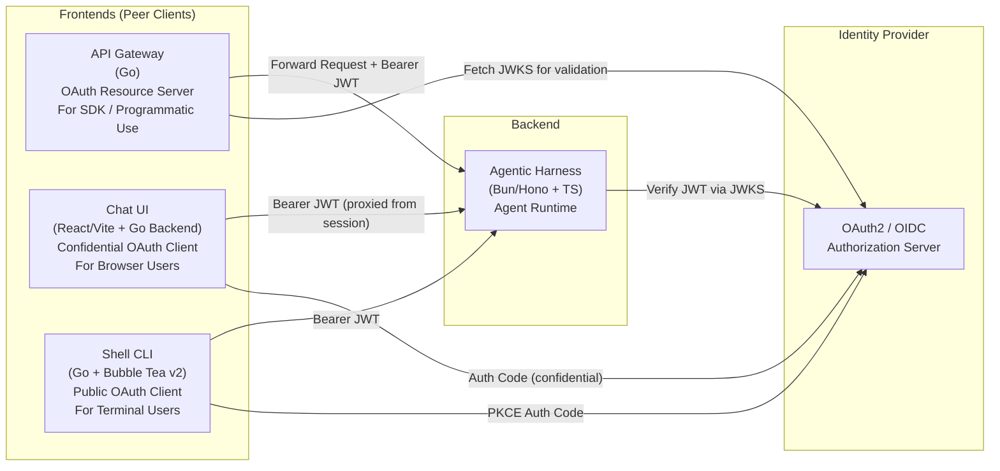

# Frontend Applications Architecture

The **BYoAI Deployment Platform** features three peer frontend applications residing in `apps/`. Each frontend serves a distinct interaction mode and communicates **directly** with the downstream [Agentic Harness](harness.md).

```mermaid
graph LR
    subgraph "Frontends (Peer Clients)"
        GW["API Gateway<br/>(Go)<br/>OAuth Resource Server<br/>For SDK / Programmatic Use"]
        ChatUI["Chat UI<br/>(React/Vite + Go Backend)<br/>Confidential OAuth Client<br/>For Browser Users"]
        CLI["Shell CLI<br/>(Go + Bubble Tea v2)<br/>Public OAuth Client<br/>For Terminal Users"]
    end

    subgraph "Backend"
        AH["Agentic Harness<br/>(Bun/Hono + TS)<br/>Agent Runtime"]
    end

    subgraph "Identity Provider"
        IDP["OAuth2 / OIDC<br/>Authorization Server"]
    end

    GW -->|"Forward Request + Bearer JWT"| AH
    ChatUI -->|"Bearer JWT (proxied from session)"| AH
    CLI -->|"Bearer JWT"| AH

    GW -->|"Fetch JWKS for validation"| IDP
    ChatUI -->|"Auth Code (confidential)"| IDP
    CLI -->|"PKCE Auth Code"| IDP
    AH -->|"Verify JWT via JWKS"| IDP
```

---

## 1. Chat UI (`apps/chat-ui`)
- **Role**: Rich web chat interface for browser users.
- **Frontend**: Vite + React 19 + TypeScript + Tailwind CSS v4 + `@assistant-ui/react`.
- **Go Backend**: Confidential OAuth client that handles authorization code flow, manages encrypted session cookies (`gorilla/sessions`), injects Bearer tokens server-side, and serves the static SPA via `embed.FS`.
- **Non-blocking Event-Driven Flow**: User message submission (`POST /interactions/:id`) returns immediately `{ success: true }` without blocking on agent turn execution. The SSE stream `/interactions/:id/events` drives the UI state (`agent:run` locks input and sets typing indicator, while `agent:complete` or `agent:error` unlocks the input area immediately upon completion).

## 2. Shell CLI (`apps/shell-cli`)
- **Role**: Terminal user interface (TUI) and batch CLI for developers.
- **TUI Engine**: Built with Charm's `bubbletea/v2`, `lipgloss/v2`, and `bubbles/v2`.
- **OAuth PKCE**: Public OAuth client initiating browser authorization flow with an ephemeral localhost callback receiver and storing tokens at `~/.byoai/tokens.json`.
- **Modes**: Supports both interactive turn-based chat and non-interactive one-shot batch tasks.
- **SSE Event Subscription**: Employs recursive `tea.Cmd` event reading off Go channels (`StreamEvents`) to dispatch incoming SSE events (`agent:run`, `agent:message`, `tool:call`, `tool:complete`, `agent:complete`, `agent:error`) into Bubble Tea `Update()` loops, ensuring the terminal prompt unlocks immediately when `agent:complete` is received.

