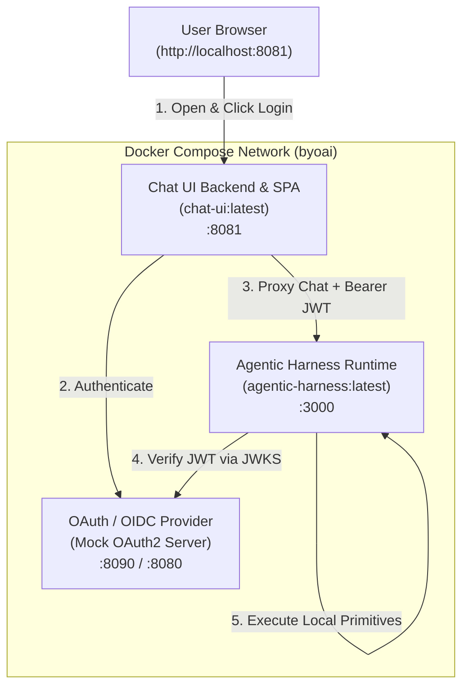

# Local Computer Use Agent Example

This example demonstrates how to configure and run an AI Agent with direct **Local Computer Use** execution primitives using the `@byo-ai-agent-platform` architecture.

It supports two execution modes:
1. **Full-Stack Docker Compose (Recommended for Web UI)**: Orchestrates the Chat UI web frontend, Mock OAuth2/OIDC identity provider, and Agentic Harness runtime in containers.
2. **Direct CLI / Local Harness**: Runs the agent harness directly on your host system with Bun.

---

## 🏛️ Architecture Overview



---

## 📦 Services in the Stack

| Service | Container Image | Port (Host:Container) | Description |
|---|---|---|---|
| **`oauth-provider`** | `ghcr.io/navikt/mock-oauth2-server:2.1.10` | `8090:8080` | Lightweight self-hosted OIDC / OAuth2 identity provider with login UI and JWKS token verification. |
| **`agentic-harness`** | `agentic-harness:latest` | `3000:3000` | Core agent runtime running Bun + TypeScript. Evaluates LLM instructions and runs local computer commands. |
| **`chat-ui`** | `chat-ui:latest` | `8081:8081` | Full-featured chat interface built with React 19, Tailwind CSS v4, and Go confidential OAuth client backend. |

---

## 📂 Directory Structure

```
examples/computer-use-agent-local/
├── README.md        # This documentation
├── agent.yaml       # Computer use agent configuration (local provider)
├── computer.yaml    # Computer controller configuration (local mode)
├── compose.yaml     # Docker Compose orchestration file
├── .env.example     # Environment variables template
├── .gitignore       # Ignores local environment files
├── run-compose.sh   # Interactive Docker Compose launcher
└── run-agent.sh     # Local standalone agent runner
```

---

## 🚀 Quick Start (Docker Compose)

### 1. Build Container Images

From the root of the repository, build all project packages and Docker container images:

```bash
task build_container_images
```

### 2. Configure Environment

Copy `.env.example` to `.env` and set your `GEMINI_API_KEY`:

```bash
cp .env.example .env
```

### 3. Start the Full Stack

Launch the stack using the orchestrator script:

```bash
./run-compose.sh
```

Or directly with Docker Compose:

```bash
docker compose up
```

### 4. Interact via Web UI

1. Open your browser at [http://localhost:8081](http://localhost:8081).
2. Click **Login** and authenticate through the mock identity provider (enter any username, e.g. `alice`).
3. Try sample prompts:
   - *"List all files in the current working directory."*
   - *"Write a greeting message to hello.txt and read it back."*
   - *"What operating system and node version are you running on?"*

---

## 💻 Standalone Local Execution

To run the agent directly on your host machine:

```bash
export GEMINI_API_KEY="your-gemini-api-key"
./run-agent.sh
```

> **Note**: Do not run untrusted prompts against the local computer provider without appropriate sandboxing. For isolated execution, see [`examples/docker-computer-use`](../docker-computer-use).

---

## 🛑 Stopping the Stack

To stop and remove running containers:

```bash
docker compose down
```
