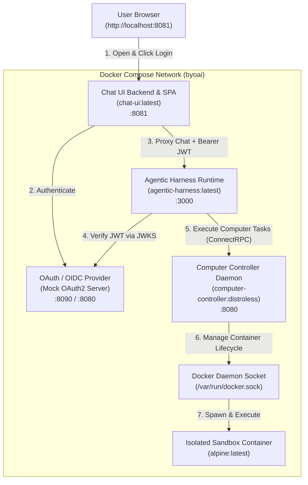

# Docker Computer Use Agent Example

This example demonstrates how to deploy and run an AI Agent with **Docker Container Computer Use** capabilities connected remotely to `apps/computer_controller/` over ConnectRPC.

It supports two execution modes:
1. **Full-Stack Docker Compose (Recommended)**: Orchestrates the Chat UI web frontend, Mock OAuth2/OIDC provider, Computer Controller daemon (with Docker socket access), and Agentic Harness runtime in isolated containers.
2. **Direct CLI / Local Harness**: Runs the agent harness locally with Bun, connecting to a locally running Computer Controller daemon in Docker mode.

---

## 🏛️ Architecture Overview



---

## 📦 Services in the Stack

| Service | Container Image | Port (Host:Container) | Description |
|---|---|---|---|
| **`oauth-provider`** | `ghcr.io/navikt/mock-oauth2-server:2.1.10` | `8090:8080` | Lightweight self-hosted OIDC / OAuth2 identity provider with login UI and JWKS token verification. |
| **`computer-controller`** | `computer-controller:distroless` | `8080:8080` | Go daemon running in Docker mode with access to `/var/run/docker.sock` to spawn isolated sandbox containers. |
| **`agentic-harness`** | `agentic-harness:latest` | `3000:3000` | Core agent runtime running Bun + TypeScript. Evaluates LLM instructions and dispatches computer actions. |
| **`chat-ui`** | `chat-ui:latest` | `8081:8081` | Full-featured chat interface built with React 19, Tailwind CSS v4, and Go confidential OAuth client backend. |

---

## 📂 Directory Structure

```
examples/docker-computer-use/
├── README.md        # This documentation
├── agent.yaml       # Harness agent configuration (remote computer provider)
├── computer.yaml    # Computer controller configuration (docker mode)
├── compose.yaml     # Docker Compose orchestration file
├── .env.example     # Environment variables template
├── .gitignore       # Ignores local environment files
├── run-compose.sh   # Interactive Docker Compose launcher
└── run-agent.sh     # Local standalone agent runner
```

---

## 🚀 Quick Start (Docker Compose)

### 1. Build Container Images

From the root of the repository, build all project packages and Docker container images:

```bash
task build_container_images
```

### 2. Configure Environment

Copy `.env.example` to `.env` and set your `GEMINI_API_KEY`:

```bash
cp .env.example .env
```

### 3. Start the Full Stack

Launch the stack using the orchestrator script:

```bash
./run-compose.sh
```

Or directly with Docker Compose:

```bash
docker compose up
```

### 4. Interact via Web UI

1. Open your browser at [http://localhost:8081](http://localhost:8081).
2. Click **Login** and authenticate through the mock identity provider (enter any username, e.g. `alice`).
3. Try sample prompts:
   - *"Check the current hostname, kernel version, and root directory contents inside your container sandbox."*
   - *"Create a shell script that calculates the first 10 Fibonacci numbers and execute it."*
   - *"Inspect what environment variables and tools are available in the container environment."*

---

## 💻 Standalone Local Execution

To run the controller and agent directly without Docker Compose:

### Step 1: Start the Computer Controller in Docker Mode
```bash
cd apps/computer_controller
cp ../../examples/docker-computer-use/computer.yaml ./computer.yaml
task run
```

### Step 2: Run the Agent Harness
In another terminal:
```bash
export GEMINI_API_KEY="your-gemini-api-key"
./examples/docker-computer-use/run-agent.sh
```

---

## 🛑 Stopping the Stack

To stop and remove running containers:

```bash
docker compose down
```
