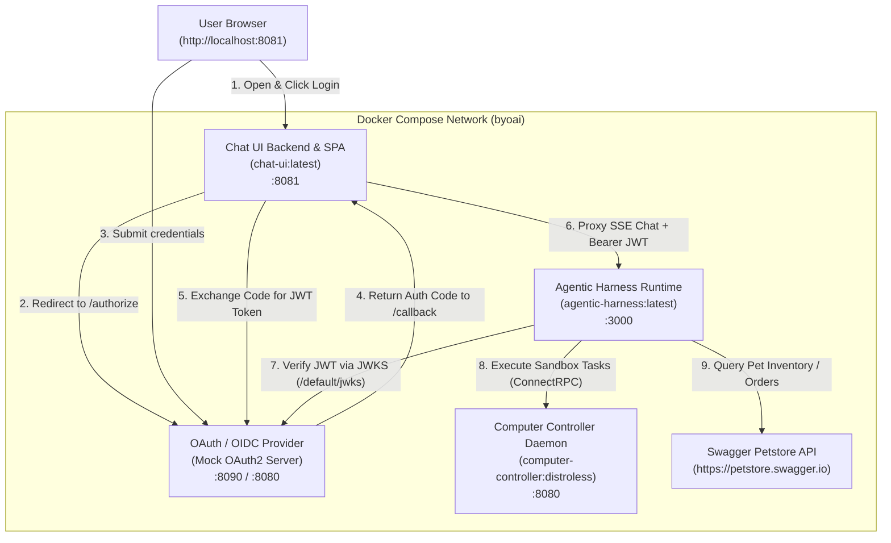

# Full Stack Orchestration Example (Docker Compose)

This example demonstrates how to orchestrate the complete **BYoAI Deployment Platform** stack using Docker Compose and the pre-built container images generated by `task build_container_images`.

---

## 🏛️ Architecture Overview

The compose stack orchestrates the full end-to-end lifecycle, including authentication, agent execution, computer environment sandbox, and web interface:



---

## 📦 Services in This Stack

| Service | Container Image | Port (Host:Container) | Description |
|---|---|---|---|
| **`oauth-provider`** | `ghcr.io/navikt/mock-oauth2-server:2.1.10` | `8090:8080` | Lightweight, zero-config self-hosted OIDC / OAuth2 identity provider with an interactive login UI, JWKS endpoint, and token issuer. |
| **`computer-controller`** | `computer-controller:distroless` | `8080:8080` | High-performance Go daemon running local sandboxed computer execution primitives (ConnectRPC). |
| **`agentic-harness`** | `agentic-harness:latest` | `3000:3000` | Core agent runtime running Bun + TypeScript. Evaluates LLM instructions, tools, skills, and validates JWT security. |
| **`chat-ui`** | `chat-ui:latest` | `8081:8081` | Full-featured chat interface built with React 19, Tailwind CSS v4, and Go confidential OAuth client backend. |
| **`api-gateway`** *(Optional)* | `api-gateway:latest` | `8082:8080` | OAuth Resource Server reverse proxy for programmatic SDK/CLI consumers (activated via `--profile gateway`). |

---

## 🚀 Quick Start

### 1. Build Container Images

From the root of the repository, build all project packages and docker container images:

```bash
task build_container_images
```

This compiles all Go binaries, builds the frontend bundle, runs unit tests, and creates:
- `agentic-harness:latest`
- `computer-controller:distroless`
- `chat-ui:latest`
- `api-gateway:latest`
- `shell-cli:latest`

### 2. Configure Environment

Copy `.env.example` to `.env` and configure your API key:

```bash
cp .env.example .env
```

Edit `.env` to provide your `GEMINI_API_KEY`:

```env
GEMINI_API_KEY=your-actual-gemini-api-key
CC_API_KEY=dev-computer-key
SESSION_SECRET=dev-session-secret-key-at-least-32-bytes!
```

### 3. Start the Stack

You can start the entire stack using the helper script:

```bash
./run-compose.sh
```

Or directly via `docker compose`:

```bash
# Package the skills archive if not already created
./create-skills-zip-file.sh

# Launch the containers
docker compose up
```

To run in detached background mode:

```bash
docker compose up -d
```

---

## 💬 Interacting with the Agent

1. **Access Chat UI**: Open your browser and navigate to:
   ```
   http://localhost:8081
   ```
2. **Login**: Click the **Login** button. You will be redirected to the lightweight identity provider at `http://localhost:8090/default/authorize`.
   - Enter any username (e.g. `alice` or `developer`) and click **Submit**.
   - You will be redirected back to `http://localhost:8081`, authenticated and ready to chat.
3. **Try Sample Prompts**:
   - *"What available pets do we have in the inventory?"* (Triggers OpenAPI PetStore tool & inventory skill)
   - *"Help me adopt pet ID 1 and place an order."* (Triggers the multi-step adoption workflow skill)
   - *"Check the current hostname, user ID, and directory contents using your computer tools."* (Triggers the sandboxed Computer Controller tool)

---

## 🛠️ Configuration Details

### Agent Configuration (`agent.yaml`)
Configures the LLM provider, skill packages, OpenAPI tool providers, computer controller tool provider, and OIDC JWKS token verification:

```yaml
name: FullStackDemoAgent
description: A helpful AI assistant capable of managing pet adoptions, querying inventory, and performing safe computer actions in a sandboxed container.

models:
  - name: gemini-3.7-flash
    brand: gemini
    properties:
      apiKey: "${GEMINI_API_KEY}"

skillRepositories:
  - type: zip
    location: "${AGENT_SKILLS_PATH:-/workspace/skills.zip}"
    skillsSubdirectory: "/skills/"

toolProviders:
  - name: petstore
    type: openapi
    specUrl: "https://petstore.swagger.io/v2/swagger.json"
    securityVariables:
      type: apiKey
      name: api_key
      key: "special-key"
      location: header

  - type: computer
    provider:
      type: remote
      url: "http://computer-controller:8080"
      image: "alpine:latest"
      enableGUIToolsIfAvailable: false
      security:
        bearerToken: "${CC_API_KEY:-dev-computer-key}"

security:
  jwksUri: "http://oauth-provider:8080/default/jwks"
  alg:
    - RS256
  verify:
    iss: "http://localhost:8090/default"
```

### Computer Controller (`computer.yaml`)
Configures the sandboxed daemon for container execution:

```yaml
type: Local
server:
  host: "0.0.0.0"
  port: 8080
  security:
    bearerToken: "${CC_API_KEY:-dev-computer-key}"
```

---

## 🛑 Stopping the Stack

To stop and remove all running containers:

```bash
docker compose down
```

To clean up volumes and orphan containers:

```bash
docker compose down -v --remove-orphans
```
