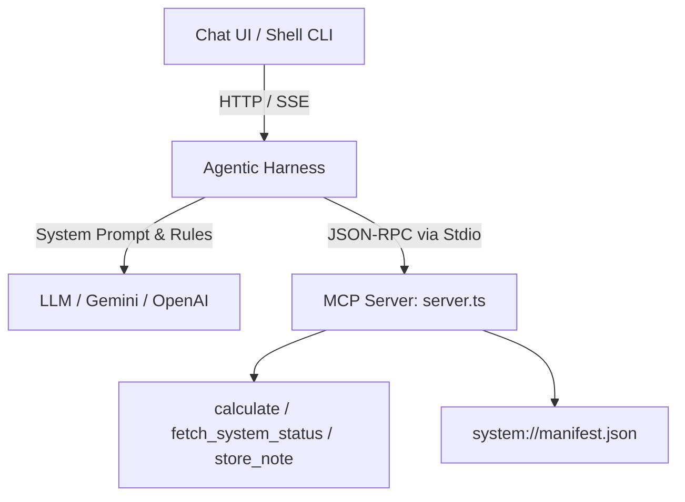

# Model Context Protocol (MCP) Agent Example

This example demonstrates how to configure and run an agent backed by **Model Context Protocol (MCP)** tool providers on the BYoAI platform.

MCP provides an open standard for connecting AI models to local tools, databases, resources, and external microservices.

---

## Features Demonstrated

1. **MCP Tool Provider with Stdio Transport (`transport: stdio`)**:
   - Spawns a local TypeScript/Bun MCP server (`server.ts`) as a child process.
   - Automatically negotiates protocol capabilities and discovers tools and resources dynamically via JSON-RPC 2.0.
2. **Local Tools & Resources**:
   - `system_mcp_tools_calculate`: Arithmetic operations (`add`, `subtract`, `multiply`, `divide`, `power`).
   - `system_mcp_tools_fetch_system_status`: Inspects runtime environment (Bun version, platform, memory usage, uptime).
   - `system_mcp_tools_store_note`: Stores key-value notes in agent memory.
   - `system_mcp_read_resource` & `system_mcp_list_resources`: Reads static and dynamic MCP resources (e.g., `system://manifest.json`).
3. **Tool Governance & Human-in-the-Loop Approvals**:
   - `allowedTools`: Restricts which tools the agent can see and call.
   - `userInputTools`: Enforces user authorization before sensitive tools (`store_note`) can execute.
4. **Behavioral Rules**:
   - Combines inline rules with external policy files (`rules.txt`).

---

## Architecture Overview



### Supported MCP Transports

| Transport | Description | Configuration Example |
| :--- | :--- | :--- |
| `stdio` | Spawns a local executable or script via standard input/output | `command: bun`, `args: ["run", "./server.ts"]` |
| `http` | Connects to a remote HTTP/SSE MCP server with Bearer/Basic/mTLS auth | `transport: http`, `url: "https://mcp.acme.corp/sse"` |
| `computer` | Runs an MCP server inside a sandboxed container (via Computer Controller) | `transport: computer`, `command: "uvx"`, `args: ["mcp-server-sqlite"]` |

---

## Configuration (`agent.yaml`)

```yaml
name: McpAgent
description: An intelligent assistant demonstrating Model Context Protocol (MCP) tool integration.

models:
  - name: gemini-3.7-flash
    brand: gemini
    properties:
      apiKey: "${GEMINI_API_KEY}"

# Operational rules
rules:
  - "Always format calculation steps and final answers clearly."
  - "Before writing or modifying memory notes, confirm the key and value with the user."
  - file: ./rules.txt

toolProviders:
  - name: system_mcp
    type: mcp
    transport: stdio
    command: bun
    args:
      - "run"
      - "${MCP_SERVER_SCRIPT:-./examples/mcp-agent/server.ts}"
    allowedTools:
      - "system_mcp_tools_calculate"
      - "system_mcp_tools_fetch_system_status"
      - "system_mcp_tools_store_note"
      - "system_mcp_read_resource"
      - "system_mcp_list_resources"
    userInputTools:
      - "system_mcp_tools_store_note"
```

---

## Quickstart

### 1. Configure Environment

Copy `.env.example` and supply your API key:

```bash
cp examples/mcp-agent/.env.example examples/mcp-agent/.env
```

Edit `examples/mcp-agent/.env`:

```bash
GEMINI_API_KEY="AIzaSy..."
```

### 2. Start the Agent

Run the launch script from repository root:

```bash
./examples/mcp-agent/run-agent.sh
```

### 3. Interact with the Agent

Open the **Chat UI** (`http://localhost:5173`) or use the **Shell CLI**:

```bash
cd apps/shell-cli
go run ./cmd/cli/main.go
```

#### Example Prompts

1. **Calculate**:
   > *"What is 42 multiplied by 18, and what is 2 raised to the power of 10?"*
   - Agent will invoke `system_mcp_tools_calculate`.

2. **System Diagnostics**:
   > *"Can you check the current server runtime and memory status?"*
   - Agent will invoke `system_mcp_tools_fetch_system_status`.

3. **Human-in-the-Loop Note Storage**:
   > *"Save a note with key 'deployment-target' and content 'production-us-east-1'."*
   - The agent initiates `system_mcp_tools_store_note`.
   - The harness pauses execution and requests confirmation via `tool:approval_required`.
   - In Chat UI or Shell CLI, approve or reject the tool call.
