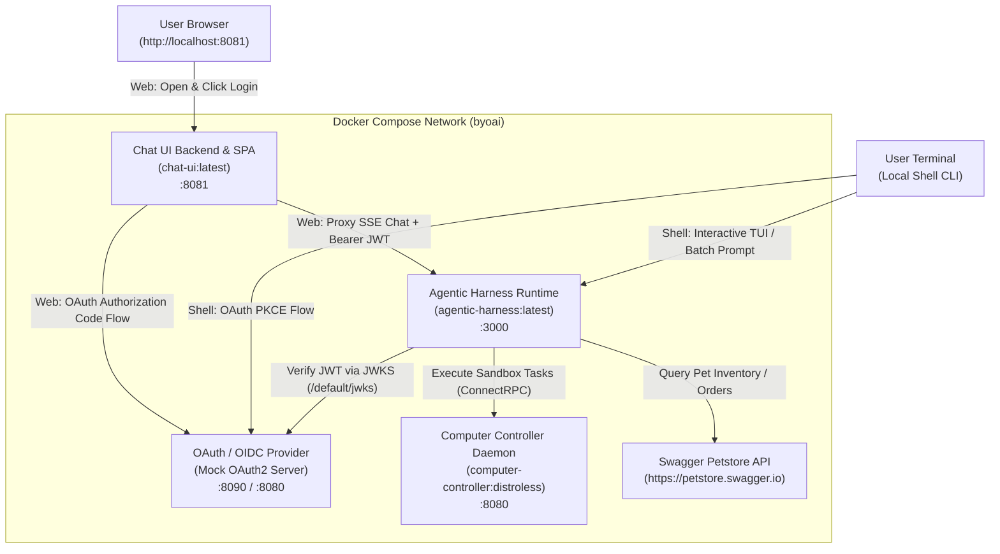

# Pet Adoption & Store Agent Example

This example demonstrates how to deploy and interact with a complete **Pet Store & Adoption Assistant** using the `@byo-ai-agent-platform` architecture.

It supports multiple interaction modes:
1. **Docker Compose with Web Chat UI**: Orchestrates the Chat UI web frontend, Mock OAuth2/OIDC provider, Computer Controller daemon, and Agentic Harness runtime in isolated Docker containers.
2. **Terminal Shell CLI with Docker Backend**: Runs the backend services (Mock OAuth2, Computer Controller, Agentic Harness) in Docker and connects the native local Shell CLI (`shell-cli`).
3. **Direct CLI / Local Harness**: Runs the agent harness locally with Bun, connecting to OpenAPI tools and progressive skills.

---

## 🏛️ Architecture Overview



---

## 📦 Services in the Stack

| Service | Container Image | Port (Host:Container) | Description |
|---|---|---|---|
| **`oauth-provider`** | `ghcr.io/navikt/mock-oauth2-server:2.1.10` | `8090:8080` | Lightweight self-hosted OIDC / OAuth2 identity provider with login UI and JWKS token verification. |
| **`computer-controller`** | `computer-controller:distroless` | `8080:8080` | Go daemon running sandboxed computer execution primitives (ConnectRPC). |
| **`agentic-harness`** | `agentic-harness:latest` | `3000:3000` | Core agent runtime running Bun + TypeScript. Evaluates LLM instructions, OpenAPI tools, and skills. |
| **`chat-ui`** | `chat-ui:latest` | `8081:8081` | Full-featured chat interface built with React 19, Tailwind CSS v4, and Go confidential OAuth client backend (`compose.yaml`). |

---

## 📂 Directory Structure

```
examples/pet-adoption-agent/
├── README.md                  # This documentation
├── agent.yaml                 # Agent configuration (models, skills repo, OpenAPI tools, computer tools)
├── computer.yaml              # Computer controller daemon configuration
├── compose.yaml               # Docker Compose orchestration file
├── shell-config.yaml          # Shell CLI configuration
├── .env.example               # Environment variables template
├── .gitignore                 # Ignores generated zip and env files
├── create-skills-zip-file.sh  # Packaging script for the skills directory
├── run-compose.sh             # Interactive Docker Compose launcher (Chat UI)
├── run-shell.sh               # Interactive launcher for local Shell CLI + Docker backend
├── run-agent.sh               # Local standalone agent runner
├── skills/                    # Procedural skill definitions
│   ├── pet-store-inventory/
│   │   └── SKILL.md           # Procedures for querying and summarizing inventory
│   └── pet-adoption-workflow/
│       └── SKILL.md           # Step-by-step workflow for adopting & ordering pets
└── skills.zip                 # (Generated) Packaged skills repository archive
```

---

## 🛠️ Available Skills

- **`pet-store-inventory`**:
  - Invoked when the user inquires about available pets, species, or general inventory counts.
  - Guides the model to use `petstore_findPetsByStatus` or `petstore_getInventory` and format pet records cleanly.
- **`pet-adoption-workflow`**:
  - Invoked when the user indicates intent to adopt or place an order for a pet.
  - Guides the model through status verification (`petstore_getPetById`), order confirmation, order placement (`petstore_placeOrder`), and adoption confirmation.

---

## 🚀 Quick Start (Docker Compose)

### 1. Build Container Images

From the root of the repository, build all project packages and Docker container images:

```bash
task build_container_images
```

### 2. Configure Environment

Copy `.env.example` to `.env` and set your `GEMINI_API_KEY`:

```bash
cp .env.example .env
```

Ensure skills are packaged:

```bash
./create-skills-zip-file.sh
```

---

### Option A: Web Chat UI Frontend

Launch the stack using the orchestrator script:

```bash
./run-compose.sh
```

Or directly with Docker Compose:

```bash
docker compose -f compose.yaml up
```

Open [http://localhost:8081](http://localhost:8081) in your browser and click **Login**.

---

### Option B: Terminal Shell CLI

Launch the stack using the interactive launcher (runs the backend services in Docker and connects the local Shell CLI):

```bash
./run-shell.sh
```

Or manually:

```bash
# 1. Start backend services in Docker
docker compose -f compose.yaml up -d oauth-provider computer-controller agentic-harness

# 2. Run the local Shell CLI binary
../../apps/shell-cli/bin/byoai -config shell-config.yaml
```

When prompted for authorization, your default browser will open automatically (or visit the displayed URL) to authenticate.

---

### Sample Prompts

Try asking the agent:
- *"What available pets do we have in the inventory?"*
- *"Help me adopt pet ID 1 and place an order."*
- *"Check the current hostname, user ID, and directory contents using your computer tools."*

---

## 💻 Standalone Local Execution

To run the agent locally without Docker containers:

```bash
export GEMINI_API_KEY="your-gemini-api-key"
./run-agent.sh
```

---

## 🛑 Stopping the Stack

To stop and remove running containers:

```bash
docker compose -f compose.yaml down
```
